##**Table of Contents**

- [1. Required Software](#required-software)
	- [1.1 Java 1.8 SDK](#java-18-jdk)
	- [1.2 Apache Tomcat](#apache-tomcat)
	- [1.3 Gradle](#gradle)
	- [1.4 IDE](#ide)
	- [1.5 Jasypt](#jasypt)
	- [1.6 MySQL](#mysql)
- [2. Setup Database Server](#setup-database-server)
- [3. Encrypt database password using Jasypt](#encrypt-database-password-using-jasypt)
- [4. Create a self-signed certificate](#create-a-self-signed-certificate)
- [5. Configure Tomcat SSL Connector](#configure-tomcat-ssl-connector)
- [6. Import project with IntelliJ IDEA](#import-project-with-intellij-idea)
- [7. Setup IDE Tomcat](#setup-ide-tomcat)
- [8. Run Tomcat from the IDE](#run-tomcat-from-the-ide)
- [9. Project Structure](#project-structure)
- [10. Project specific conventions](#project-specific-conventions)
- [11. Important Configuration Properties](#important-configuration-properties)
- [12. Tomcat Ports](#tomcat-ports)

### Required Software
#### Java 1.8 JDK
Download and install [Java 1.8+ JDK](http://www.oracle.com/technetwork/java/javase/downloads/jdk8-downloads-2133151.html).

#### Apache Tomcat
Download and install [Apache Tomcat 8](https://tomcat.apache.org/download-80.cgi).

##### Gradle
Download and install [Gradle](https://gradle.org).

#### IDE
Download and install an IDE. For example [IntelliJ IDEA](https://www.jetbrains.com/idea/download/).

#### Jasypt
Download and install [Jasypt](http://www.jasypt.org).

#### MySQL
Download and install a working MySQL database server. You can use [Oracle MySQL](https://dev.mysql.com/downloads/mysql/) or [MariaDB](https://mariadb.com/blog/installing-mariadb-10010-mac-os-x-homebrew).

### Setup database server
1. Install your MySQL server.
2. Start the server: `sudo mysql.server start`
3. Set the MySQL root password: `mysqladmin -u root password 'mysql'`
4. Create a new database for each module and name them `app`, `idat`, `psns`, `vdat` respectively.

### Encrypt database password using Jasypt
*This step is only for informational purposes since the database and database encryption password are already configured in encrypted form in the `db.properties` property file.* 

Because we will place this password in a property file so the application can access it, we need to encrypt it first using Jasypt:

1. Open your Terminal and change to your Jasypt installation directory.: `cd /Users/lucas/opt/jasypt-1.9.2/bin `
2. Run: `encrypt.sh input="mysql" password="master password" algorithm="PBEWITHMD5ANDDES"`. The output should look as follows:

> ```
> ----ENVIRONMENT-----------------
> 
> Runtime: Oracle Corporation Java HotSpot(TM) 64-Bit Server VM 25.25-b02 
> 
> ----ARGUMENTS-------------------
> 
> algorithm: PBEWITHMD5ANDDES
> input: mysql
> password: master password
> 
> ----OUTPUT----------------------
> 
> d22XcE0UgwoLdUyAYcLuGA==
> ```

The encrypted password is `d22XcE0UgwoLdUyAYcLuGA==`.

To decrypt the password you can run: `decrypt.sh input="d22XcE0UgwoLdUyAYcLuGA==" password="master password" algorithm="PBEWITHMD5ANDDES"`.

Although this is the password for the database connection, we will use the same password for the database encryption during development for simplicity reasons. We can repeat this step for arbitrary configuration properties like URLs, ports, etc, later.

### Create a self-signed certificate
In this step we will generate a keystore with self-signed certificate in it. So go ahead and fire up your Terminal and run the following command:
```
keytool -genkey -alias keyAlias -storetype PKCS12 -keyalg RSA -keysize 2048 -keystore txlKeystore.p12 -validity 3650
```

Executing this command will ask you a few identity questions:

> ```
> Enter keystore password: 123456  
> Re-enter new password: 123456
> What is your first and last name?
>   [Unknown]:  127.0.0.1
> What is the name of your organizational unit?
>   [Unknown]:  txl
> What is the name of your organization?
>   [Unknown]:  txl
> What is the name of your City or Locality?
>   [Unknown]:  txl
> What is the name of your State or Province?
>   [Unknown]:  txl
> What is the two-letter country code for this unit?
>   [Unknown]:  txl
> Is CN=127.0.0.1, OU=txl, O=txl, L=txl, ST=txl, C=txl correct?
>   [no]:  yes
```

Issue the `list` command to ensure that the keystore contains a certificate:

```
keytool -list -keystore txlKeystore.p12 -storetype PKCS12
```

The output should look similar to this:

> ```
> Enter keystore password: 123456 
> 
> Keystore type: PKCS12
> Keystore provider: SunJSSE
> 
> Your keystore contains 1 entry
> 
> keyalias, Aug 8, 2015, PrivateKeyEntry, 
> Certificate fingerprint (SHA1): 4F:53:4E:E5:12:70:F7:74:20:1B:56:1E:44:85:D0:23:2F:21:38:C3
```

Place the `txlKeystore.p12` file in a directory where you can reference it later. Example: `/Users/lucas/txlKeystore.p12`.

### Configure Tomcat SSL Connector
In this step we will configure our Tomcat server to support HTTPS. For that we need to configure an SSL connector. Open up `lucas/opt/apache-tomcat-8.0.15/conf/server.xml` and add the following line:
```xml
<Connector SSLEnabled="true" keystoreFile="/Users/lucas/txlKeystore.p12" keystoreType="PKCS12" keystorePass="123456" port="8443" scheme="https" secure="true" sslProtocol="TLS"/> 
```
above the line where it says `<Connector port="8009" protocol="AJP/1.3" redirectPort="8443" />`.

**IMPORTANT:** Since we will deploy our modules on 4 different Tomcats, we need to adjust the configuration accordingly. This can be done either by copying an existing Tomcat installation and adjusting the Connector configuration in `server.xml` to enable the port as defined in [12. Tomcat Ports](#tomcat-ports), or use one existing Tomcat installation and point Eclipse to use a different `server.xml` for each `Run Configuration`. The later is not possible in IntelliJ.

### Import project with IntelliJ IDEA
Start IntelliJ IDEA. A window will appear with options. Select `Import Project`. 

| Screenshot 1.1: IntelliJ Import |
|--------------|
| <a href="images/ide-setup-screenshot-intellij-import-1.png" >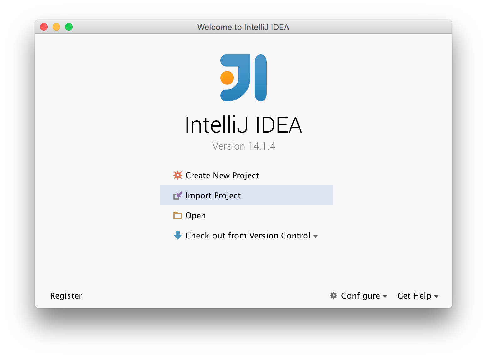</a> |

Browse to the module directory and select the root directory `prototype`. 

**IMPORTANT:** not the repository directory! If you repository is called *prototype*, then you should select *prototype/prototype*.

| Screenshot 1.2: Select Project |
|--------------|
| <a href="images/ide-setup-screenshot-intellij-import-2.png" >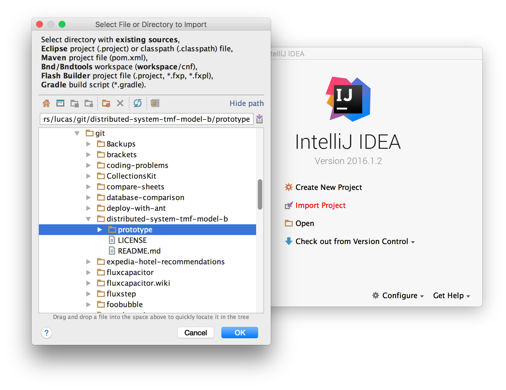</a> |

In the next view select `Gradle` and click `Next`

| Screenshot 1.3: Select Build Tool |
|--------------|
| <a href="images/ide-setup-screenshot-intellij-import-3.png" >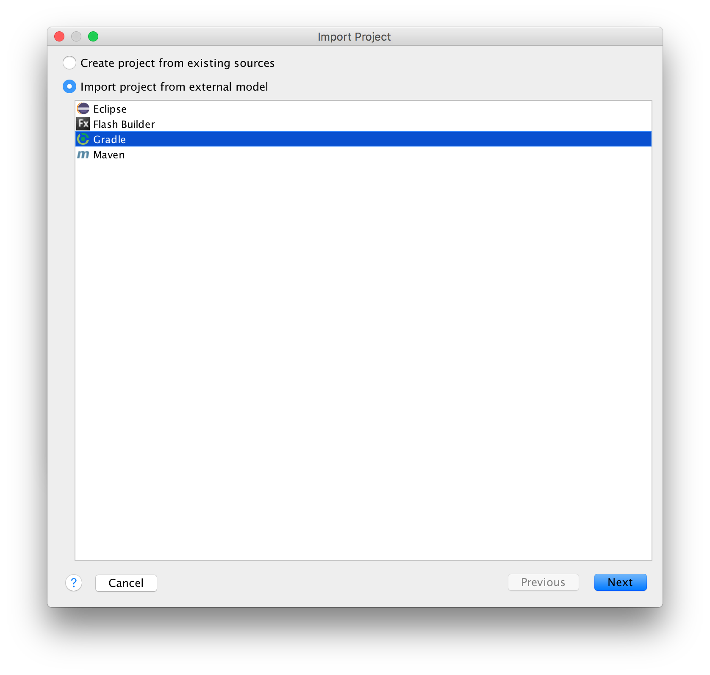</a> |

Make sure the setup looks like *Screenshot 1.4* and click `Finish`. If no JVM is available do the following: 

1. Close the window and go to the window of *Screenshot 1.1*. 
2. Navigate to `Configure -> Project Defaults -> Project Structure -> Platform Settings`. 
3. Click on the `+` button and select `JDK` to add a JDK.

| Screenshot 1.4: Gradle Distribution |
|--------------|
| <a href="images/ide-setup-screenshot-intellij-import-4.png" >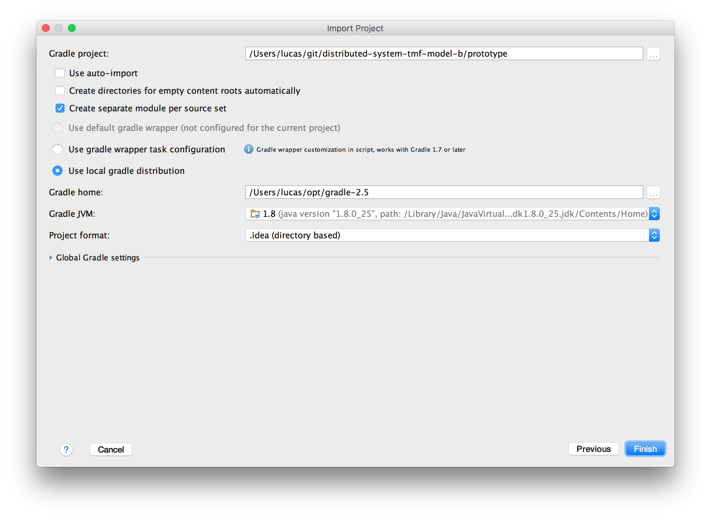</a> |

Wait until Gradle fetches all dependencies and builds the project.

| Screenshot 1.5: Finish & Build |
|--------------|
| <a href="images/ide-setup-screenshot-intellij-import-5.png" >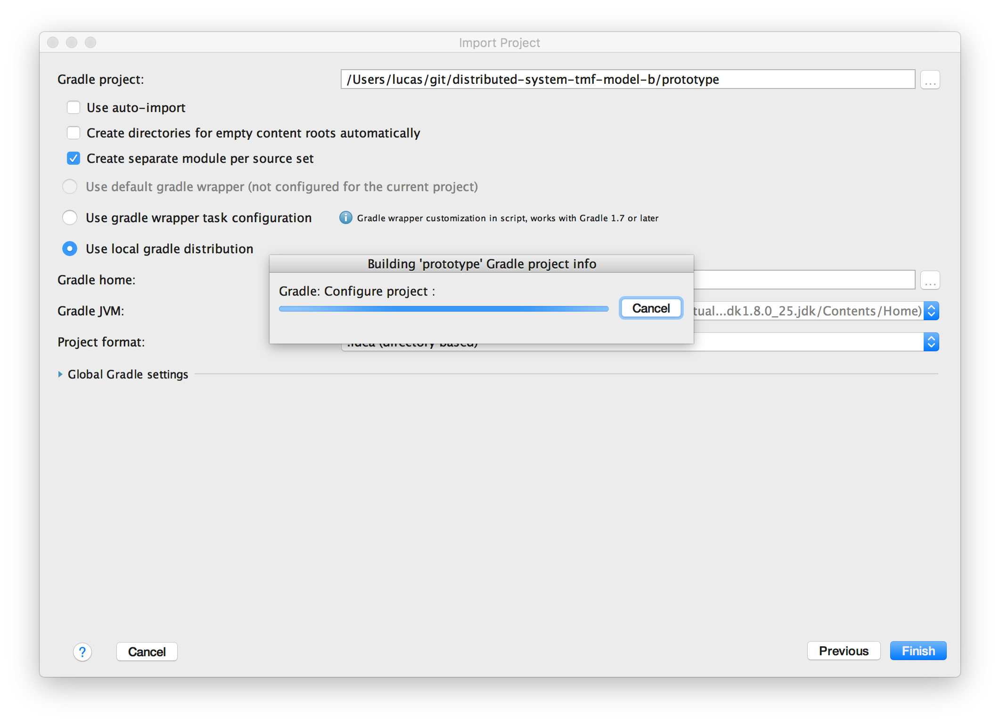</a> |

When done, the project structure should look as follows:

| Screenshot 1.6: Project Structure |
|--------------|
| <a href="images/ide-setup-screenshot-intellij-import-6.png" >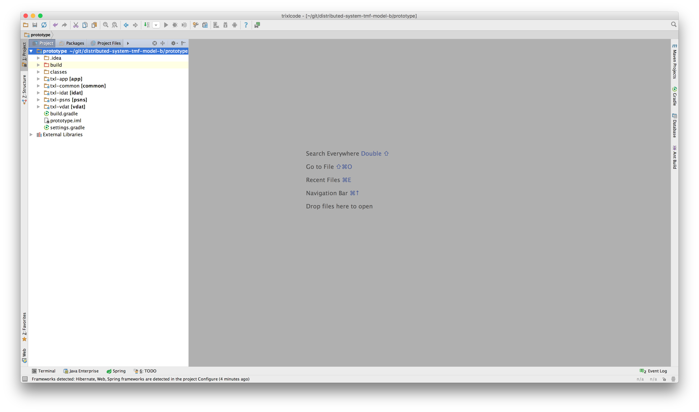</a> |

### Setup IDE Tomcat
Next we *need* to setup a global Tomcat application server so we can configure our Tomcat `Run Configurations` for each module later.

Open up IntelliJ preferences (`⌘`+`,`) and navigate to the section `Application Servers`.

| Screenshot 2.1: Application Servers settings |
|--------------|
| <a href="images/ide-setup-screenshot-intellij-tomcat-1.png" >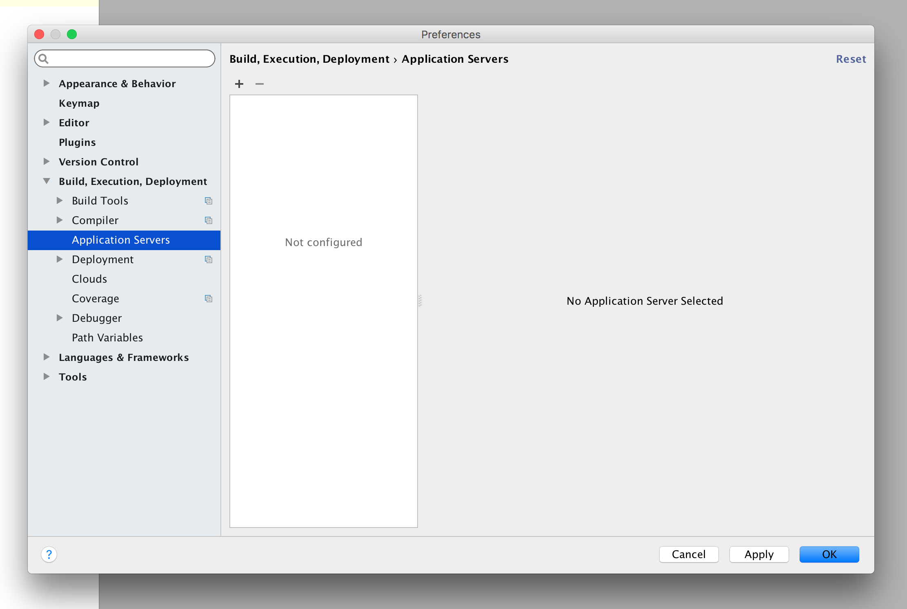</a> |

Click the `+` button to add a new application server and select `Tomcat Server`.

| Screenshot 2.2: Add Tomcat Server |
|--------------|
| <a href="images/ide-setup-screenshot-intellij-tomcat-2.png" >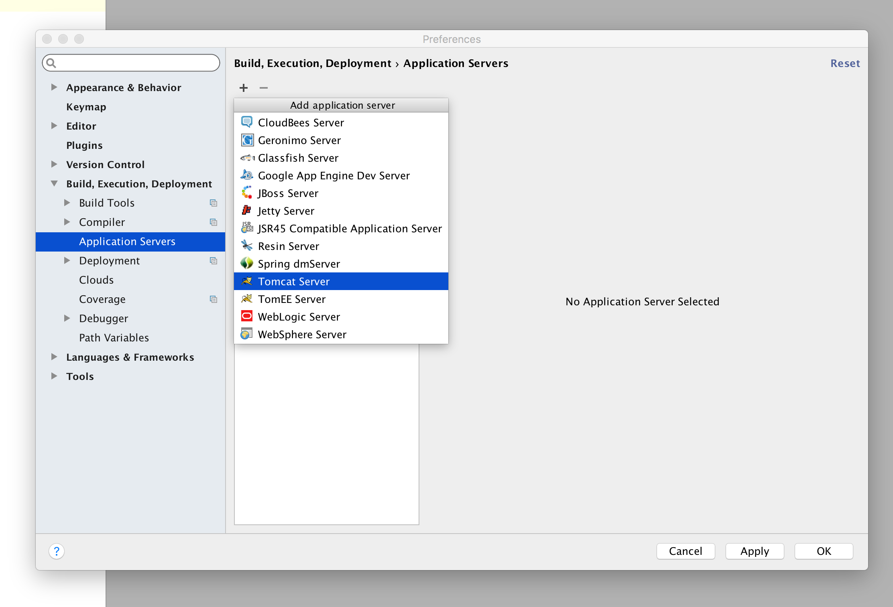</a> |

Select your `Tomcat Home` directory (installation directory) and click `OK`.

| Screenshot 2.3: Tomcat Home |
|--------------|
| <a href="images/ide-setup-screenshot-intellij-tomcat-3.png" >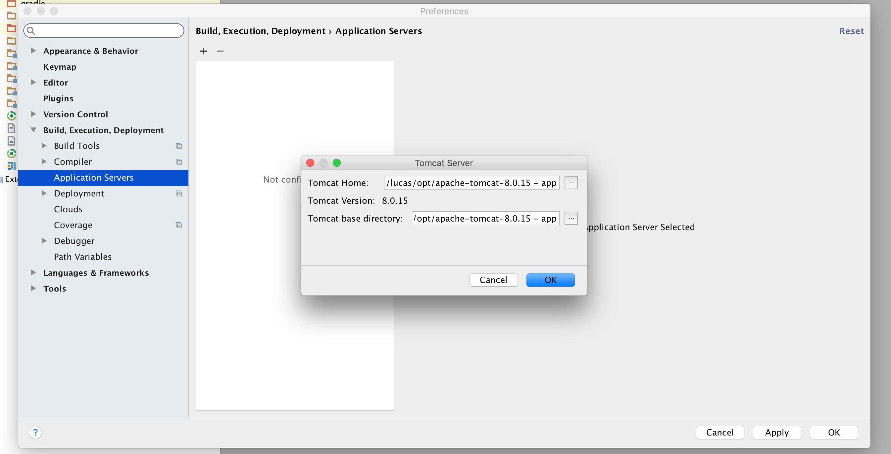</a> |

The setup should look similar to *Screenshot 2.4*.

**IMPORTANT FOR INTELLIJ USERS:** Since we will be using 4 Tomcat Run Configurations, each of which will have a different `server.xml` configuration, it is better if you setup 4 Tomcats, with each IntelliJ Tomcat pointing to a different `Tomcat Home` installation directory. For **Eclipse** users the replication of Tomcat installations is not necessary, since Eclipse allows the specification of a different `server.xml` file for each `Run Configuration` (`Project Explorer` -> `Servers` -> *Tomcat XY*). 


| Screenshot 2.4: Tomcat setup |
|--------------|
| <a href="images/ide-setup-screenshot-intellij-tomcat-4.png" >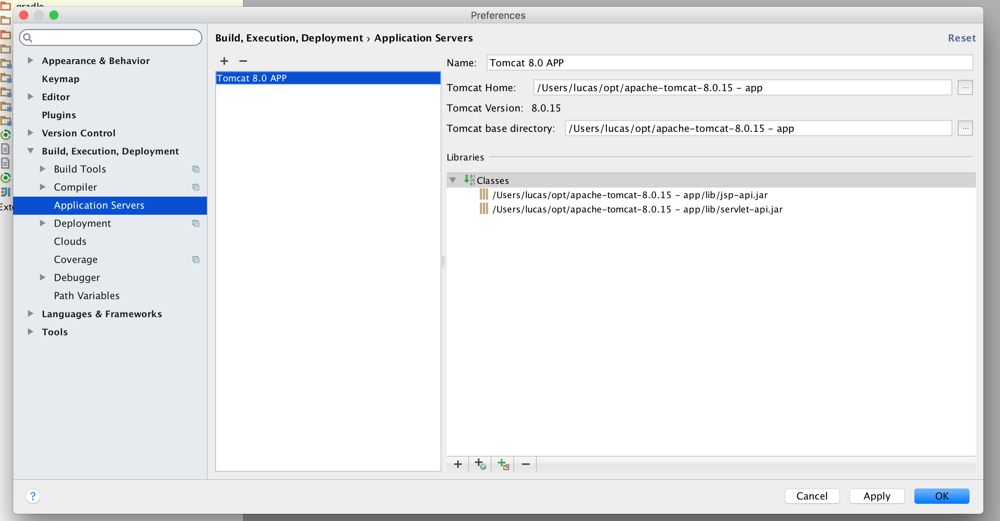</a> |
| <a href="images/ide-setup-screenshot-intellij-tomcat-4-all-modules.png" >All modules Tomcat</a> |

Next we need to setup a `Run Configuration`. Although this guide is for the *APP* module, the following steps should be repeated for all other modules since we want to simulate a live scenario where every module runs on a separate Tomcat.

Go to IntelliJ run configurations: `Run -> Edit Configurations...`.

| Screenshot 2.5: Run Configurations |
|--------------|
| <a href="images/ide-setup-screenshot-intellij-tomcat-5.png" >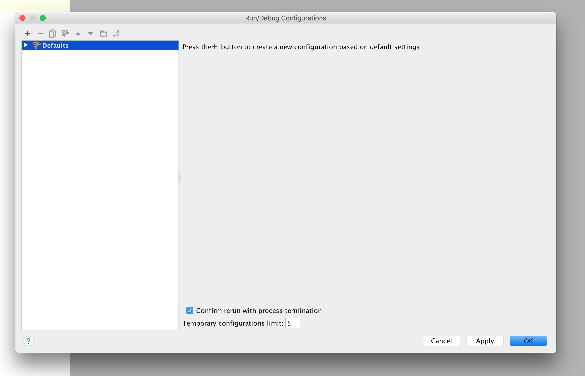</a> |

Click on the `+` to add a new run configuration and select `Tomcat Server -> Local`.

| Screenshot 2.6: Select Tomcat Server |
|--------------|
| <a href="images/ide-setup-screenshot-intellij-tomcat-6.png" >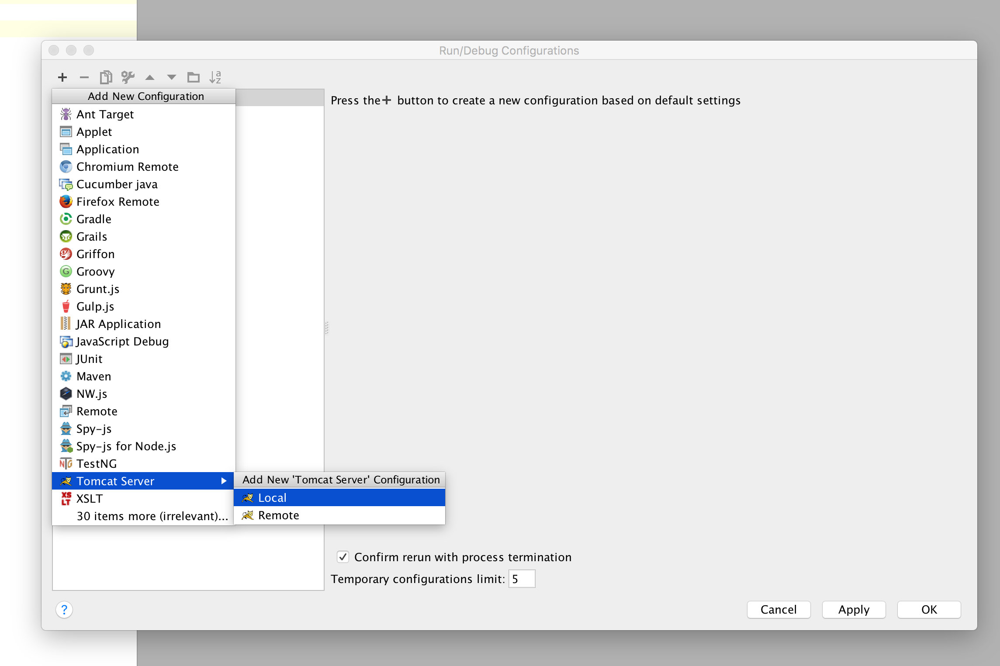</a> |

Name it `APP` as this will be the run configuration for `APP`.

**HOT DEPLOYMENT:** If you want to enable *hot deployment*, you can choose *Update classes and resources* under `On 'Update' action` and under `On frame deactivation`.

**IMPORANT:** Make sure the ports used for every module are different! See [12. Tomcat Ports](#tomcat-ports).

**IMPORTANT FOR INTELLIJ USERS:** If you created 4 different Tomcats earlier, make sure to select the right Tomcat under `Application server`.

| Screenshot 2.7: Run Configuration APP |
|--------------|
| <a href="images/ide-setup-screenshot-intellij-tomcat-7-app.png" >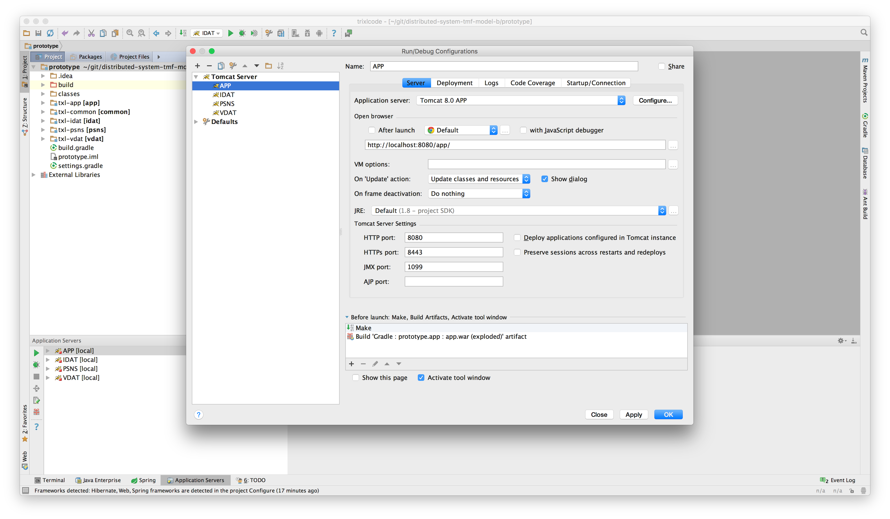</a> |
| See also: <a href="images/ide-setup-screenshot-intellij-tomcat-7-idat.png" >IDAT</a> - <a href="images/ide-setup-screenshot-intellij-tomcat-7-psns.png" >PSNS</a> - <a href="images/ide-setup-screenshot-intellij-tomcat-7-vdat.png" >VDAT</a> |


Switch to the `Deployment` tab and click on the `+` to add a new Artifact that should be deployed. Select `app.war` or the `app.war (exploded)` for *hot deployment*. Click `OK`.

| Screenshot 2.8: Select Artifacts to deploy|
|--------------|
| <a href="images/ide-setup-screenshot-intellij-tomcat-8.png" >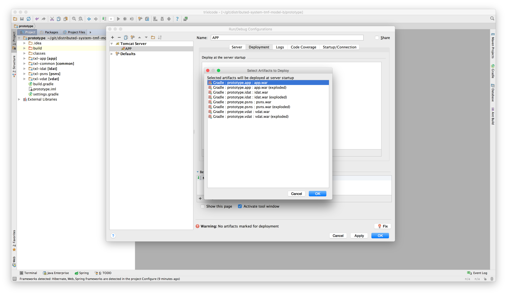</a> |

The setup should look as *Screenshot 2.9*. 

**IMPORANT:** Make sure that the `Application context` is set to *module-name*! For APP the context must be `/app`. For IDAT the context must be `/idat`. For PSNS the context must be `/psns`. For VDAT the context must be `/vdat`.

| Screenshot 2.9: Artifacts to deploy |
|--------------|
| <a href="images/ide-setup-screenshot-intellij-tomcat-9.png" >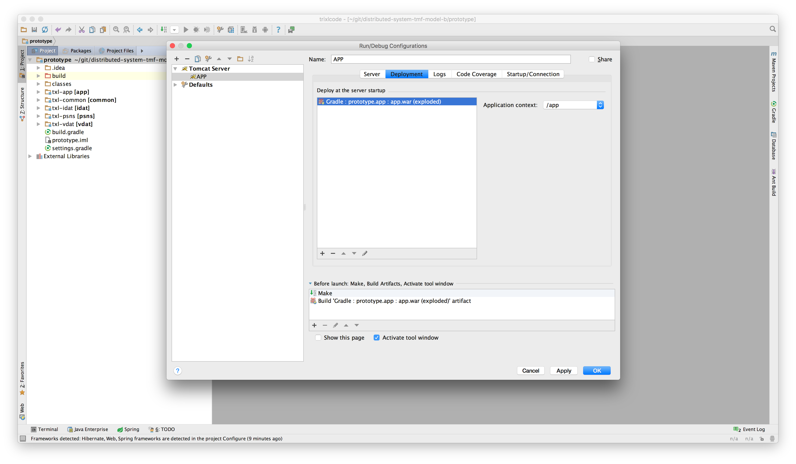</a> |

Switch to the tab `Startup/Connection` and add a new `environment variable` named `PASSWORD_ENV_VARIABLE` with value `master password`. This variable will be passed to the application on startup and its value will be used to decrypt any encrypted properties later on. This is the same `master password` as used in step [Encrypt database password using Jasypt](#encrypt-database-password-using-jasypt). Click `OK`.

| Screenshot 2.10: Environment Variable |
|--------------|
| <a href="images/ide-setup-screenshot-intellij-tomcat-10.png" >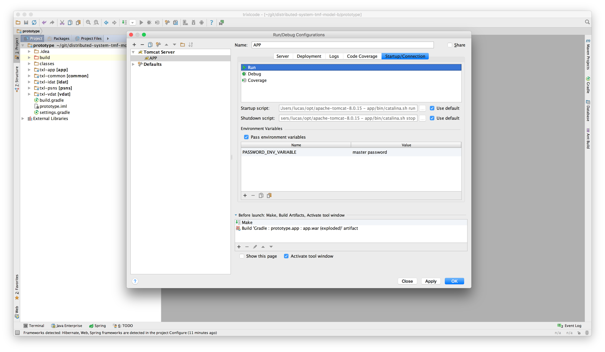</a> |

Also setup the `PASSWORD_ENV_VARIABLE` for `Debug` modus.

| Screenshot 2.11: Environment Variable Debug |
|--------------|
| <a href="images/ide-setup-screenshot-intellij-tomcat-10-debug.png" >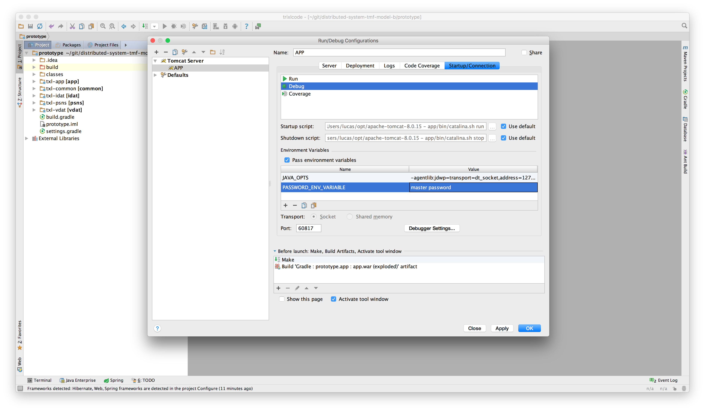</a> |


### Run Tomcat from the IDE
In this step we will start our Tomcat Servers and test our freshly deployed application.

Hover over or click the icon on the bottom left corner in the IntelliJ project window. Select `Application Servers`. This will open up a view with all your configured application server run configurations.

| Screenshot 3.1: Show Application Servers Run Configurations |
|--------------|
| <a href="images/ide-setup-screenshot-intellij-run-1.png" >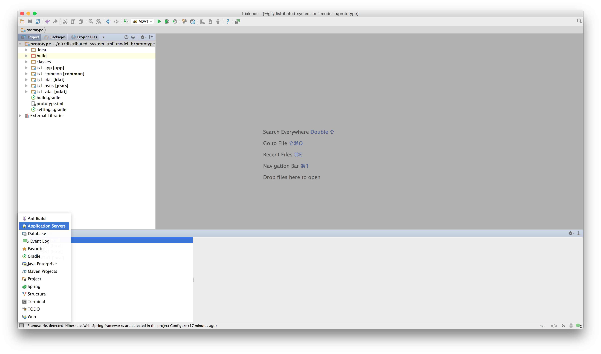</a> |

Select `APP`.

| Screenshot 3.2: IDE Start Tomcat |
|--------------|
| <a href="images/ide-setup-screenshot-intellij-run-2.png" >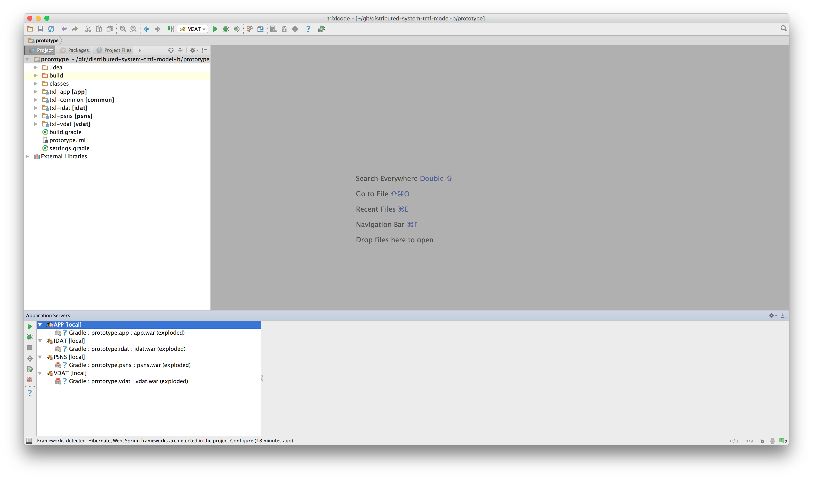</a> |

Click on the green *play* button () to start the Tomcat server. The application should have deployed without any problems
and the `console` output should look similar to *Screenshot 3.3*.

| Screenshot 3.3: IDE Start Tomcat APP |
|--------------|
| <a href="images/ide-setup-screenshot-intellij-run-3.png" >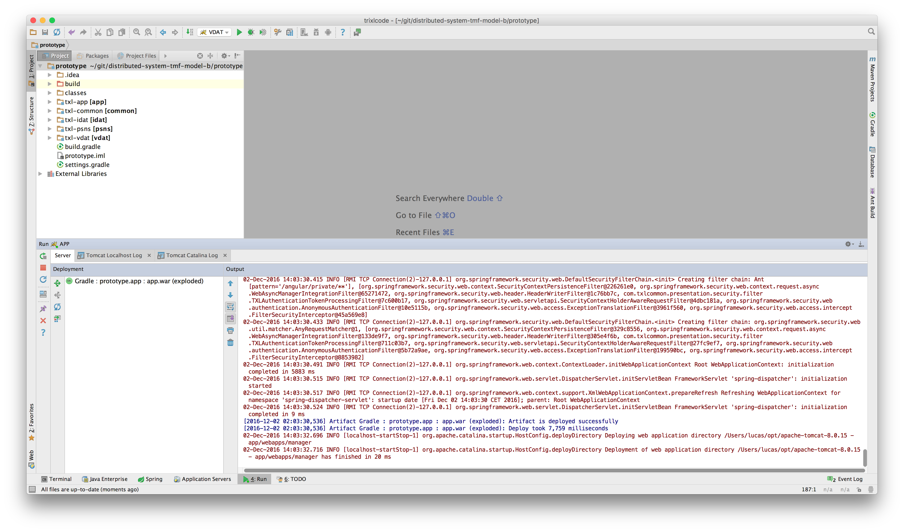</a> |

Next, start the *IDAT* Tomcat. The application should have deployed without any problems
and the `console` output should look similar to *Screenshot 3.4*.

| Screenshot 3.4: IDE Start Tomcat IDAT |
|--------------|
| <a href="images/ide-setup-screenshot-intellij-run-4.png" >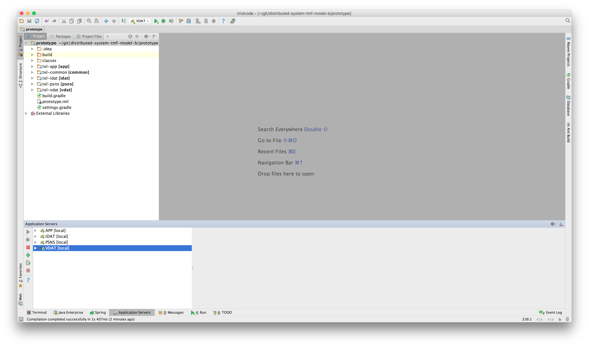</a> |


Next open up your web browser and connect to [https://localhost:8443/app](https://localhost:8443/app). You will see something similar to *Screenshot 3.5*.

| Screenshot 3.5: Open application in browser |
|--------------|
| <a href="images/ide-setup-screenshot-intellij-run-5.png" >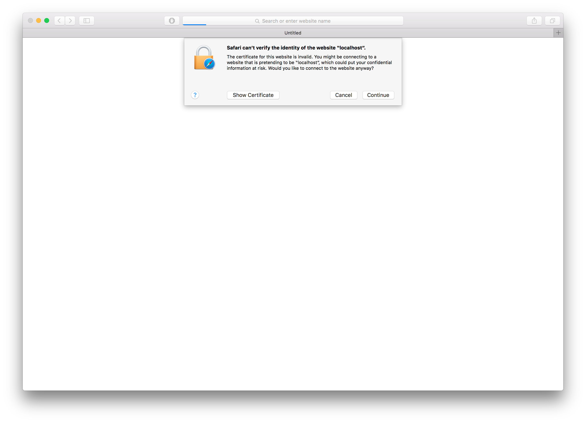</a> |

Examining the certificate details you will notice that those are the details entered in step [Create a self-signed certificate](#create-a-self-signed-certificate).

| Screenshot 3.6: Certificate details|
|--------------|
| <a href="images/ide-setup-screenshot-intellij-run-6.png" >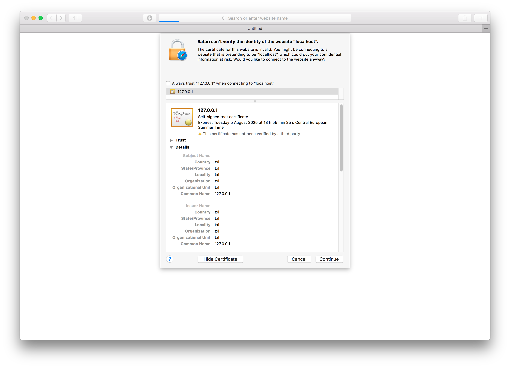</a> |


Clicking on `Continue` will lead you to the login page. 

| Screenshot 3.7: Login Page|
|--------------|
| <a href="images/ide-setup-screenshot-login-page.png" >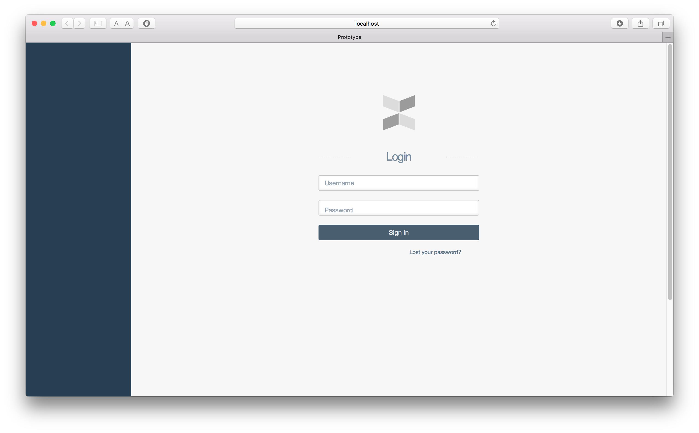</a> |


Repeat this step for all modules and accept the certificate, if necessary. This is required because the application requests resources from different servers and the cerificate has to be accepted first.
- [https://localhost:8443/app/](https://localhost:8443/app)
- [https://localhost:8444/idat](https://localhost:8444/idat) 
- [https://localhost:8445/psns](https://localhost:8445/psns) 
- [https://localhost:8446/vdat](https://localhost:8446/vdat) 

**IMPORTANT:** Notice the different port!

Once done return to the login page and click on `login` and login using the `username` = *admin* and `password` = *admin*.  This will trigger a login on the APP, IDAT, VDAT and PSNS server (Cross Origin) and redirect you to the main page.

| Screenshot 3.8: Main Page |
|--------------|
| <a href="images/ide-setup-screenshot-main-page.png" >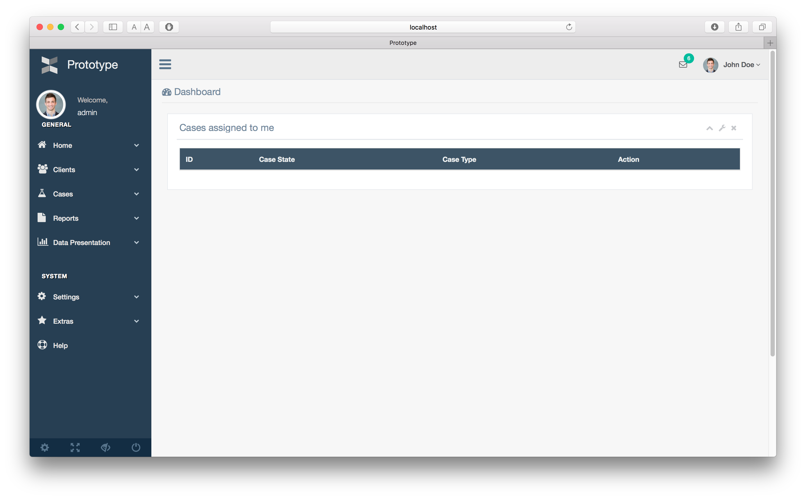</a> |

You can navigate to *Cases -> New* and create a new case. When finished, the client identification data (Client Profile) will have been saved into IDAT while case relevant data will have been saved into VDAT.


| Screenshot 3.9: Create New Case |
|--------------|
| <a href="images/ide-setup-screenshot-new-case-page.png" >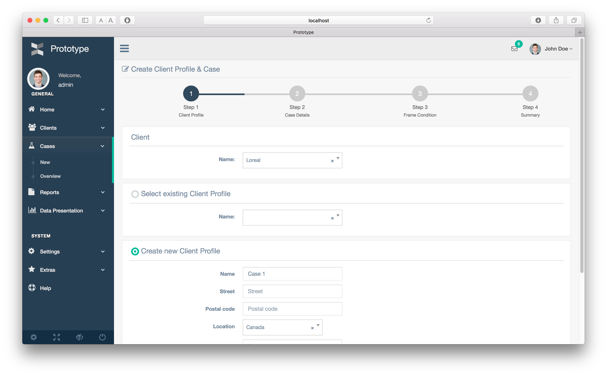</a> |

You can navigate to *Cases -> Overview*. This will fetch client information from IDAT as well as case data from VDAT.

| Screenshot 3.10: Fetch Case |
|--------------|
| <a href="images/ide-setup-screenshot-cases-overview-page.png" >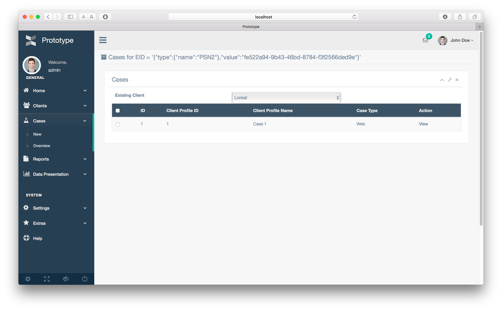</a> |

### Project Structure
The Java Projects for each module will be [Gradle](https://gradle.org/) projects and multiple project builds. That is, they will consist of different subprojects. The project structure for a single module (*module-name*) is listed below:


| Project Name | Description |
|--------------|--------------|
| *module-name* (app, idat, psns, vdat) | Parent project that connects subprojects. No source code in here. |
| *module-name*-presentation| Public API of module. It is a collection of Spring `Controllers` that handle HTTP requests. It also holds the Spring configuration files. In the *APP* module this subproject also holds the views.|
| *module-name*-service| `Service` Spring bean implementations go in here. A `Service` bean does the business logic of the module. It is usually called by the `Controllers` in the module-presentation project. |
| *module-name*-domain|`Domain` objects go in here. These are usually objects that are handled by `Service` beans and will be persisted to the database. Example: `FrameCondition`.|
| *module-name*-api |Interfaces for `Service` beans go in here. module-api consists only of interfaces that are implemented in module-service and `Exceptions` that are used in module-service|
| *module-name*-dao |Interfaces for [DAO](https://en.wikipedia.org/wiki/Data_access_object). module-dao consists only of interfaces that are implemented in module-dummy or module-dao-hibernate |
| *module-name*-dao-dummy|Dummy implementation of the DAO interfaces defined in module-dao. DAOs are usually called by `Service` beans. DAOs make use of module-domain objects. A DAO dummy does not persist any data to the database. It creates/reads dummy data and simulates data persistence/read.|
| *module-name*-dao-hibernate|Hibernate implementation of the DAO interfaces defined in module-dao. DAOs are usually called by `Service` beans. DAOs make use of module-domain objects. Any database configuration, that is not a Spring configuration, goes in here. Such a configuration can be a Hibernate configuration (`hibernate.cfg.xml`), a Hibernate mapping configuration (`FrameCondition.hbm.xml`), Jasypt configuration (`jasyptHibernateTypes.hbm.xml`), etc. Any Spring related configuration, such as `sessionFactory`, `transactionManager`, etc goes into the Spring configuration files located in the module-presentation project. Hibernate DAOs persist data to the database using the [Hibernate](http://hibernate.org/) ORM framework.||

In addition to the above sub projects we also have a project called *common* which follows the same inner structure (api, dao, etc) as all the other modules. This project holds functionality that is common to *all* modules, such as user management.

| Project Name | Description |
|--------------|--------------|
| common | This project holds functionality that is common to *all* modules, such as user management.|


### Project specific conventions
#### Namespacing
This is to avoid confusing application classes and interfaces from framework (Spring, Hibernate, etc) components. We will use the prefix `TXL` for all classes.
> Do this:
```java
public class TXLUser {
}
```
Not this:
```java
public class User {
}
```

### Important Configuration Properties
| Name | Scope | Value |  Encrypted Value |Description |
|--------------|--------------|--------------|--------------|--------------|
|`db.password`| Database Connection Password | `mysql` | `d22XcE0UgwoLdUyAYcLuGA==` | Use `ENC(d22XcE0UgwoLdUyAYcLuGA==)` when storing in property file |
|`db.encryptionPassword`| Database Encryption Password | `mysql` | `d22XcE0UgwoLdUyAYcLuGA==` | Use `ENC(d22XcE0UgwoLdUyAYcLuGA==)` when storing in property file |
|`PASSWORD_ENV_VARIABLE`| Properties Decryption Password | `master password` |  | Setup as environment variable in Tomcat configuration |

### Tomcat Ports
| Module | HTTP Port | HTTPS Port | JMX Port | Application Context | URL |
|--------------|--------------|--------------|--------------|--------------|--------------|
| APP | 8080 | 8443 | 1099 | /app |[https://127.0.0.1:8443/app](https://127.0.0.1:8443/app) or [https://localhost:8443/app](https://localhost:8443/app)|
| IDAT | 8081 | 8444 | 1100 |/idat |[https://127.0.0.1:8444/idat](https://127.0.0.1:8444/idat) or [https://localhost:8444/idat](https://localhost:8444/idat)|
| PSNS | 8082 | 8445 | 1101 |/psns |[https://127.0.0.1:8445/psns](https://127.0.0.1:8445/psns) or [https://localhost:8445/psns](https://localhost:8445/psns)|
| VDAT | 8083 | 8446 | 1102 |/vdat |[https://127.0.0.1:8446/vdat](https://127.0.0.1:8446/vdat) or [https://localhost:8446/vdat](https://localhost:8446/vdat)|

### Test users
Below is a list of development users that can be used to test the different functionalities of the system.

|Username| Password | Type | Role | Comment | Sites |
|-------|-------|-------|-------|-------|-------|
|admin| admin| PENTESTER | ADMIN| |SiteA, SiteB|
|puser1| puser1 | PENTESTER | USER| |SiteA, SiteB|
|puser2| puser2 | PENTESTER | USER| |SiteA, SiteB|
|ecuser1| ecuser1 | END CLIENT | USER| |SiteA, SiteB|
|ecuser1| ecuser1 | END CLIENT | USER| |SiteA, SiteB|
